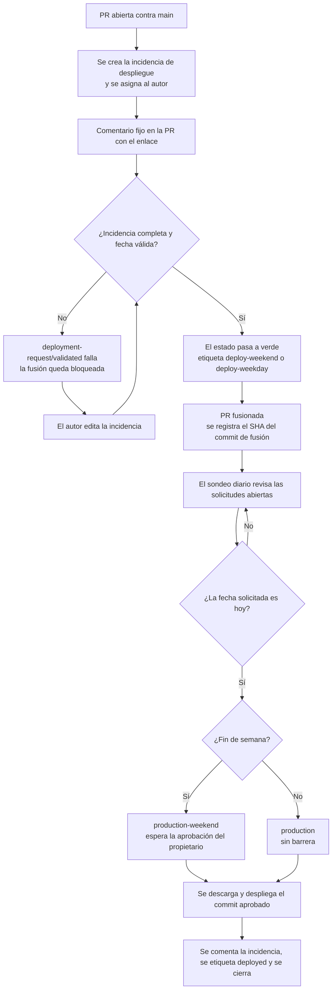

# DeferredDeployments

*[English](README.md)*

Los despliegues a `main` son **programados, no inmediatos**. Cada pull request genera una
*incidencia de solicitud de despliegue* que recoge cuándo debe publicarse el cambio y qué
contiene. El despliegue se ejecuta en esa fecha, con una aprobación que depende de quién deba
autorizarlo.

| Fecha solicitada (Europe/Madrid) | Entorno              | Aprobación                       |
| -------------------------------- | -------------------- | -------------------------------- |
| Sábado o domingo                 | `production-weekend` | Propietario del repositorio      |
| De lunes a viernes               | `production`         | Ninguna — se ejecuta sin vigilancia |

## Cómo funciona



1. **Se abre una PR contra `main`.** `pr-deployment-request.yml` crea la incidencia de
   solicitud de despliegue, la asigna al autor de la PR y publica un comentario fijo en la PR
   que enlaza directamente con ella. Ese comentario es lo más parecido a «redirigir al
   formulario» que GitHub permite — véase [Limitaciones](#limitaciones).
2. **La fusión queda bloqueada hasta completar la solicitud.** El estado de commit
   `deployment-request/validated` falla mientras la incidencia carezca de una fecha futura
   válida, un resumen o un plan de reversión. El comentario fijo indica exactamente qué falta.
3. **La validación se repite en cada edición de la incidencia.**
   `validate-deployment-request.yml` la analiza, aplica `deploy-weekend` o `deploy-weekday` y
   pone el estado en verde sin necesidad de un nuevo push.
4. **Al fusionar se registra el SHA del commit de fusión** como comentario en la incidencia.
   Ese es exactamente el commit que se desplegará más adelante.
5. **Un sondeo diario ejecuta el despliegue.** `scheduled-deploy.yml` recoge las solicitudes
   fusionadas y validadas cuya fecha sea hoy y llama a `deploy.yml` con el entorno
   correspondiente. Los despliegues de fin de semana se detienen a la espera de aprobación;
   los de días laborables continúan.

## Estructura del repositorio

| Ruta                                              | Propósito                                                        |
| ------------------------------------------------- | ---------------------------------------------------------------- |
| `.github/ISSUE_TEMPLATE/deployment-request.yml`    | El formulario de solicitud de despliegue.                        |
| `.github/scripts/deployment-issue.js`              | Análisis de la incidencia, validación de fechas y regla de fin de semana. |
| `.github/scripts/deployment-issue.test.js`         | Pruebas unitarias de lo anterior.                                |
| `.github/workflows/pr-deployment-request.yml`      | Crea la incidencia, publica el comentario fijo y fija el estado. |
| `.github/workflows/validate-deployment-request.yml` | Revalida al editar, etiqueta y elimina duplicados.              |
| `.github/workflows/scheduled-deploy.yml`           | Sondeo diario que localiza los despliegues previstos para hoy.   |
| `.github/workflows/deploy.yml`                     | Trabajo de despliegue reutilizable con la barrera dinámica.      |
| `.github/workflows/tests.yml`                      | Ejecuta las pruebas unitarias.                                   |

### `deployment-issue.js`

Este módulo es la única fuente de verdad de la lógica de programación: los tres flujos de
automatización lo importan, de modo que la regla de fin de semana no puede divergir entre ellos.

| Exportación       | Comportamiento                                                                              |
| ----------------- | ------------------------------------------------------------------------------------------- |
| `parseIssue`      | Convierte el cuerpo del formulario en un mapa de campos, tratando `_No response_` como vacío. |
| `renderBody`      | Genera un cuerpo con los mismos encabezados, para las incidencias creadas automáticamente.   |
| `todayInTz`       | La fecha de hoy en `Europe/Madrid`.                                                          |
| `classify`        | Valida una fecha y devuelve `isWeekend`, el entorno de destino y la etiqueta.                |
| `validateRequest` | Comprobación completa de una solicitud; devuelve todos los problemas a la vez.               |

Una fecha se rechaza si no tiene el formato `YYYY-MM-DD`, si no es una fecha real del
calendario (`2026-02-31`) o si está en el pasado.

### Campos del formulario

| Id del campo  | Etiqueta                         | Obligatorio |
| ------------- | -------------------------------- | ----------- |
| `pr`          | Pull Request number              | Sí          |
| `deploy_date` | Deployment date (YYYY-MM-DD)     | Sí          |
| `summary`     | What is being deployed?          | Sí          |
| `risk`        | Risk level (low / medium / high) | Sí          |
| `rollback`    | Rollback plan                    | Sí          |

### Etiquetas

Las etiquetas se crean automáticamente la primera vez que se aplican.

| Etiqueta             | Significado                                                              |
| -------------------- | ------------------------------------------------------------------------ |
| `deployment-request` | Identifica la incidencia como solicitud de despliegue. Activa todo el flujo. |
| `pending-details`    | La solicitud está incompleta; la fusión está bloqueada.                  |
| `pr-<número>`        | Vincula la incidencia con su pull request.                               |
| `deploy-weekend`     | La fecha cae en sábado o domingo.                                        |
| `deploy-weekday`     | La fecha cae de lunes a viernes.                                         |
| `merged`             | La PR está fusionada y el SHA del commit está registrado.                |
| `deployed`           | El despliegue tuvo éxito; la incidencia se cierra.                       |
| `deployment-failed`  | El despliegue se ejecutó pero falló.                                     |

## Configuración inicial

Estos pasos no se pueden configurar desde el código y deben realizarse en los ajustes del
repositorio.

**Entornos** — Settings → Environments:

- `production-weekend` — añádete como **revisor obligatorio**. Opcionalmente, restringe la
  rama de despliegue a `main`.
- `production` — créalo **sin** revisores.

**Conjunto de reglas** — Settings → Rules → Rulesets, aplicado a `main`:

- Exigir una pull request antes de fusionar.
- Exigir la comprobación de estado `deployment-request/validated`.

> Mientras no exista el conjunto de reglas, la solicitud de despliegue es solo informativa: la
> comprobación se publica, pero nada impide la fusión.

**Comandos de despliegue** — `deploy.yml` ejecuta actualmente un paso `Deploy` de marcador de
posición. Sustitúyelo por los comandos reales. El trabajo ya verifica que el commit descargado
coincide con el SHA registrado al fusionar, de modo que una fusión posterior a `main` no puede
alterar en silencio lo que se publica.

## Uso diario

**Como desarrollador:** abre tu PR, pulsa el enlace del comentario del bot, rellena la fecha y
los detalles, y fusiona cuando la comprobación pase a verde. Para reprogramar, edita la
incidencia: la validación se repite automáticamente.

**Como aprobador:** los despliegues de fin de semana aparecen como una revisión pendiente en la
ejecución del entorno `production-weekend` la mañana de la fecha solicitada. Apruébalos ahí.

Para probar sin esperar a la programación, ejecuta **Scheduled deployment** manualmente desde
la pestaña Actions. Marca `dry_run` para listar lo que está previsto sin desplegar nada.

## Personalización

- **Zona horaria o días de fin de semana** — modifica `TZ` o la comprobación del día de la
  semana en `classify`.
- **Festivos** — amplía `classify` para consultar una lista de festivos y devolver también el
  entorno de fin de semana en esas fechas.
- **Una barrera real entre semana** — crea un equipo `deploy-approvers` y añádelo como revisor
  obligatorio del entorno `production`. No hace falta cambiar ningún flujo de trabajo.
- **Hora del despliegue** — ajusta el `cron` de `scheduled-deploy.yml`. Está en UTC.

## Resolución de problemas

| Síntoma                                              | Causa                                                                                    |
| ---------------------------------------------------- | ---------------------------------------------------------------------------------------- |
| La comprobación sigue en rojo tras corregir la incidencia | El campo `pr` no corresponde a un número de PR real, así que el estado no puede publicarse. |
| No aparece ninguna incidencia ni comentario en la PR  | La PR procede de un fork, que solo recibe un token de solo lectura.                       |
| Se omite un despliegue previsto                       | La incidencia no tiene un SHA de fusión registrado: la PR no se fusionó, o se fusionó antes de existir estos flujos. |
| La ejecución programada no arranca                    | El cron de GitHub no garantiza la hora y puede retrasarse; los flujos programados se desactivan tras 60 días de inactividad. |
| Existen dos incidencias para una misma PR             | Es lo esperado si también se rellenó el formulario a mano. La más reciente se cierra como duplicada automáticamente. |

## Limitaciones

- **Nada puede redirigir el navegador tras crear la PR.** GitHub Actions no puede llevar al
  autor a ninguna página, por lo que se usa el enlace del comentario fijo.
- **`@copilot` no puede aprobar un despliegue.** Los revisores obligatorios de un entorno deben
  ser usuarios o equipos con acceso al repositorio, y el agente de programación Copilot no es
  elegible. Por eso los despliegues entre semana no tienen barrera en lugar de ser aprobados
  por `@copilot`.
- **Los formularios de incidencia no tienen selector de fecha.** La fecha es un campo de texto
  validado por el flujo de trabajo.
- **Las PR desde forks no están cubiertas**, como se indica arriba.
- **Solo sábado y domingo** cuentan como días no laborables; los festivos no están modelados.
- **Las aprobaciones de entorno caducan** tras unos 30 días de espera.

## Pruebas

```bash
node --test .github/scripts/deployment-issue.test.js
```
