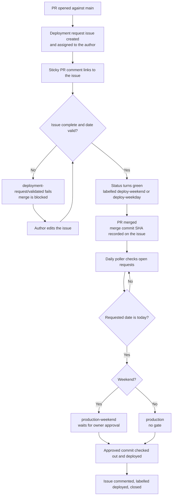

# DeferredDeployments

*[Español](README.es.md)*

Deployments to `main` are **scheduled, not immediate**. Every pull request gets a *deployment
request issue* that captures when the change should ship and what it contains. The deployment
then runs on that date, gated by who has to approve it.

| Requested date (Europe/Madrid) | Environment          | Approval               |
| ------------------------------ | -------------------- | ---------------------- |
| Saturday or Sunday             | `production-weekend` | Repository owner       |
| Monday to Friday               | `production`         | None — runs unattended |

## How it works



1. **PR opened against `main`.** `pr-deployment-request.yml` creates a deployment request
   issue, assigns it to the PR author, and posts a sticky comment on the PR linking straight
   to it. That comment is the closest thing to the "redirect to the form" behaviour that
   GitHub permits — see [Limitations](#limitations).
2. **Merge is blocked until the request is complete.** The commit status
   `deployment-request/validated` reports failure while the issue is missing a valid future
   date, a summary, or a rollback plan. The sticky comment lists exactly what is still missing.
3. **Validation re-runs on every issue edit.** `validate-deployment-request.yml` parses the
   issue, applies `deploy-weekend` or `deploy-weekday`, and flips the commit status green
   without needing a new push.
4. **On merge, the merge commit SHA is recorded** as a comment on the issue. This is the exact
   commit that will later be deployed.
5. **A daily poller runs the deployment.** `scheduled-deploy.yml` picks up merged, validated
   requests whose date is today and calls `deploy.yml` with the matching environment. Weekend
   deployments pause for approval; weekday deployments proceed.

## Repository layout

| Path                                             | Purpose                                                        |
| ------------------------------------------------ | -------------------------------------------------------------- |
| `.github/ISSUE_TEMPLATE/deployment-request.yml`   | The deployment request form.                                    |
| `.github/scripts/deployment-issue.js`             | Issue parsing, date validation and the weekend rule.            |
| `.github/scripts/deployment-issue.test.js`        | Unit tests for the above.                                       |
| `.github/workflows/pr-deployment-request.yml`     | Creates the issue, posts the sticky comment, sets the status.    |
| `.github/workflows/validate-deployment-request.yml` | Re-validates on edit, labels, deduplicates.                   |
| `.github/workflows/scheduled-deploy.yml`          | Daily poller that finds deployments due today.                  |
| `.github/workflows/deploy.yml`                    | Reusable deployment job with the dynamic approval gate.         |
| `.github/workflows/tests.yml`                     | Runs the unit tests.                                            |
| `.github/ruleset.json`                            | Branch ruleset definition for `main`, applied with the GitHub CLI. |

### `deployment-issue.js`

This module is the single source of truth for the schedule logic — all three automation
workflows import it, so the weekend rule cannot drift between them.

| Export            | Behaviour                                                                        |
| ----------------- | -------------------------------------------------------------------------------- |
| `parseIssue`      | Turns the rendered form body into a field map, treating `_No response_` as empty. |
| `renderBody`      | Produces a body with the same headings, used for auto-created issues.             |
| `todayInTz`       | Today's date in `Europe/Madrid`.                                                  |
| `classify`        | Validates a date and returns `isWeekend`, the target environment and the label.    |
| `validateRequest` | Full check of a request, returning every problem at once.                         |

A date is rejected if it is not `YYYY-MM-DD`, is not a real calendar date (`2026-02-31`), or
is in the past.

### Form fields

| Field id      | Label                            | Required |
| ------------- | -------------------------------- | -------- |
| `pr`          | Pull Request number              | Yes      |
| `deploy_date` | Deployment date (YYYY-MM-DD)     | Yes      |
| `summary`     | What is being deployed?          | Yes      |
| `risk`        | Risk level (low / medium / high) | Yes      |
| `rollback`    | Rollback plan                    | Yes      |

### Labels

Labels are created automatically the first time they are applied.

| Label                | Meaning                                                    |
| -------------------- | ---------------------------------------------------------- |
| `deployment-request` | Marks the issue as a deployment request. Drives all triggers. |
| `pending-details`    | The request is incomplete; merge is blocked.                |
| `pr-<number>`        | Links the issue to its pull request.                        |
| `deploy-weekend`     | The date falls on a Saturday or Sunday.                     |
| `deploy-weekday`     | The date falls Monday to Friday.                            |
| `merged`             | The PR is merged and the commit SHA is recorded.            |
| `deployed`           | The deployment succeeded; the issue is closed.              |
| `deployment-failed`  | The deployment ran but failed.                              |

## One-time setup

These cannot be configured from code and must be done in the repository settings.

**Environments** — Settings → Environments:

- `production-weekend` — add yourself as a **required reviewer**. Optionally restrict the
  deployment branch to `main`.
- `production` — create it with **no** reviewers.

**Ruleset** — the definition lives in `.github/ruleset.json`. Apply it with the GitHub CLI:

```bash
gh auth login
gh api --method POST repos/aiturralde/DeferredDeployments/rulesets --input .github/ruleset.json
```

Check the result:

```bash
gh api repos/aiturralde/DeferredDeployments/rulesets --jq '.[] | "\(.id)  \(.name)  \(.enforcement)"'
```

It targets the default branch and enforces: no deletions, no force pushes, a pull request with
one approval, and the `deployment-request/validated` status check. The same thing can be set up
by hand under Settings → Rules → Rulesets.

The file is a record of intent, not a live binding — GitHub does not read it from the
repository. After editing it, re-apply with `PUT .../rulesets/<id>` using the id from the
command above.

> Until the ruleset exists the deployment request is advisory only: the status check reports,
> but nothing prevents the merge.

> The ruleset has no bypass list, so it applies to you as well. Add *Repository admin* to the
> **Bypass list** in the web interface if you want an emergency override.

**Deployment commands** — `deploy.yml` currently runs a placeholder `Deploy` step. Replace it
with the real commands. The job already verifies that the checked-out commit matches the SHA
recorded at merge time, so a later merge to `main` cannot silently change what ships.

## Day-to-day use

**As a developer:** open your PR, click the link in the bot comment, fill in the date and the
details, and merge once the check turns green. To reschedule, edit the issue — validation
re-runs automatically.

**As the approver:** weekend deployments appear as a pending review on the run for the
`production-weekend` environment on the morning of the requested date. Approve it there.

To test without waiting for the schedule, run **Scheduled deployment** manually from the
Actions tab. Tick `dry_run` to list what is due without deploying anything.

## Customising

- **Timezone or weekend days** — change `TZ` or the weekday check in `classify`.
- **Public holidays** — extend `classify` to consult a holiday list and return the weekend
  environment for those dates too.
- **A real weekday gate** — create a `deploy-approvers` team, add it as a required reviewer on
  the `production` environment. No workflow changes are needed.
- **Deployment time of day** — adjust the `cron` in `scheduled-deploy.yml`. It is in UTC.

## Troubleshooting

| Symptom                                       | Cause                                                                             |
| --------------------------------------------- | --------------------------------------------------------------------------------- |
| The check stays red after fixing the issue     | The `pr` field does not match a real PR number, so the status cannot be published. |
| No issue or comment appears on the PR          | The PR comes from a fork, which only gets a read-only token.                       |
| A due deployment is skipped                    | The issue has no recorded merge SHA — the PR was not merged, or was merged before these workflows existed. |
| The scheduled run does not start               | GitHub cron is best-effort and may run late; scheduled workflows are disabled after 60 days of inactivity. |
| Two issues exist for one PR                    | Expected if the form was also filled manually. The newer one is closed as a duplicate automatically. |

## Limitations

- **Nothing can redirect a browser after PR creation.** GitHub Actions cannot navigate the
  author anywhere, so the sticky comment link is used instead.
- **`@copilot` cannot approve a deployment.** Environment required reviewers must be users or
  teams with repository access, and the Copilot coding agent is not eligible. This is why
  weekday deployments are ungated rather than approved by `@copilot`.
- **Issue Forms have no date picker.** The date is a text field validated by the workflow.
- **Fork PRs are not covered**, as noted above.
- **Only Saturday and Sunday** count as non-working days; public holidays are not modelled.
- **Environment approvals expire** after roughly 30 days of waiting.

## Tests

```bash
node --test .github/scripts/deployment-issue.test.js
```
